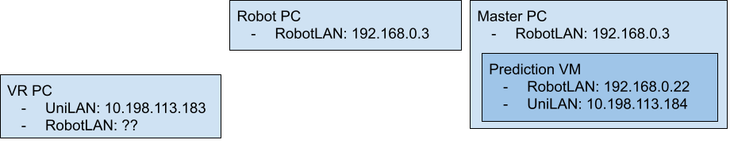

# jaxa_communication
Preliminary implementation of the delay retransmitter for Master interface signal and tool pose transmission for Virtual Reality prediction.


## System Setup



### VR PC: 
Please confirm with Professor Saul for running virtual reality program

### Robot PC: 
No changes are nesessary on top of the existing teleoperation under SAS.

### Master PC:

- Setup Prediction VM (e.g. VMWare) as similar to the Jaxa Robot PC (without the need to run on real robot, so run_simulation_* is all needed)
- Connect Prediction VM to Robot LAN, This can be done via attaching USB Ethernet adaptor to the VM or network bridge interface. Set ip to `192.168.0.22`
- Change `SmartArmMaster` Program network setting to the following
  - `ps_ip`: `192.168.0.22`
  - `ps_port`: `2220`
  - `os_port`: `2220`
- Clone the `https://gitlab.com/NML/jaxa-mhi-ros-2022` repository on Prediction VM and setup the Catkin environment. Some setting also needed modification in the default `jaxa_ros_control` package, specificlly the follwoing:
  - Point `export VREP_IP=192.168.0.xxx` in `~/.bashrc` to the ip address of the *VR PC*
  - Under `jaxa_ros_control/cfg/sas_operator_side_receiver.yaml`
    - change `"patient_side_ips": ["192.168.0.3"]` to `"patient_side_ips": ["127.0.0.1"]`
    - change `"patient_side_ports": [2223]` to `"patient_side_ports": [2220]`
    - change `"operator_side_ports": [2223]` to `"operator_side_ports": [2220]`

- Clone the repository `https://github.com/qlin-nml-research/qlin_jaxa_resources` under command workspace for `jaxa-mhi-ros-2022`


## Running the system

Please follow the following step to start the delay teleoperation.

Prerequisite: 
- Assume Virtual Overlay has started on the *VR PC*.
- SmartArm Master program is started and set with the afordmentioned configuration.

Procedure:
1. *Robot PC*: Start the computer and system up as per usual. With Cobotta and ESCON initialized. (`roscore` is also running)
2. *Master PC*: Start Coppelia sim and open the Jaxa scene.
3. *Robot PC*: Run command,
```shell
roslaunch jaxa_ros_control run_real_teleoperation.launch --screen
```
On the terminal output, wait for system to properly initialized (except for `sas_patient_side_manager` and `sas_operator_side_reciever`), and current joint configuration is updated to the CoppeliaSim. (usually this is then the terminal windows show `RobotKinematicInterface` is initialized.)

4. *Master PC*: Perform the following action on CoppeliaSim:
   - Stop simulation
   - Save scene file to an easily accessable location for the *VR PC* (ex. SPARROW)
   - Restart simulation
5. *VR PC*: Open the same saved CoppeliaSim scene file from SPARROW.
6. *Predirction VM*: In ***two*** seperate terminal instances, run the following two commands:

```shell
roscore
roslaunch jaxa_ros_control run_simulation_teleoperation.launch --screen
```

7. *VR PC*: Confirm that CoppeliaSim has started. The teleoperation is then ready to start.
8. *Predirction VM*: Run command to start transmitting tool pose to *VR PC*

```shell
roslaunch jaxa_communication tool_pose_udp_transmitter.launch --screen
```

9. *Predirction VM*: Run command to start delay retransmission for the MasterInterface control signal

```shell
roslaunch jaxa_communication manipulator_delay_retransmitter.launch --screen
```


## Basic Configuration

The node configuration currently are done under the launch file directly.

1. [`manipulator_delay_retransmitter.launch`](launch/manipulator_delay_retransmitter.launch) 

```yaml
patient_side_port: 2220
operator_side_port: 2220
retransmit_ips: ["127.0.0.1", "192.168.0.3"]
retransmit_ps_ports: [2222, 2223]
retransmit_os_ports: [2221, 2223]
retransmit_delay: [0, 5.0]
retransmit_to_master_select: [True, False]
```

- `patient_side_port` : original signal patient side port
- `operator_side_port` : original signal operator side port
- The following are list of retransmission target. `retransmit_delay` defined the (roundtrip) delay to each instance in secs.

1. [`tool_pose_udp_transmitter.launch`](launch/tool_pose_udp_transmitter.launch)

```yaml
rate: 30
port: 20023
remote_ip: 10.198.113.183
arm1_manipulator_ns: 0_1
arm1_kinematics_ns: /arm1_kinematics
arm2_manipulator_ns: 0_0
arm2_kinematics_ns: /arm2_kinematics
```

- `rate`: update rate to the Virtual Overlay.
- `port`: *VR PC* receiving port.
- `remote_ip`: *VR PC* ip.

